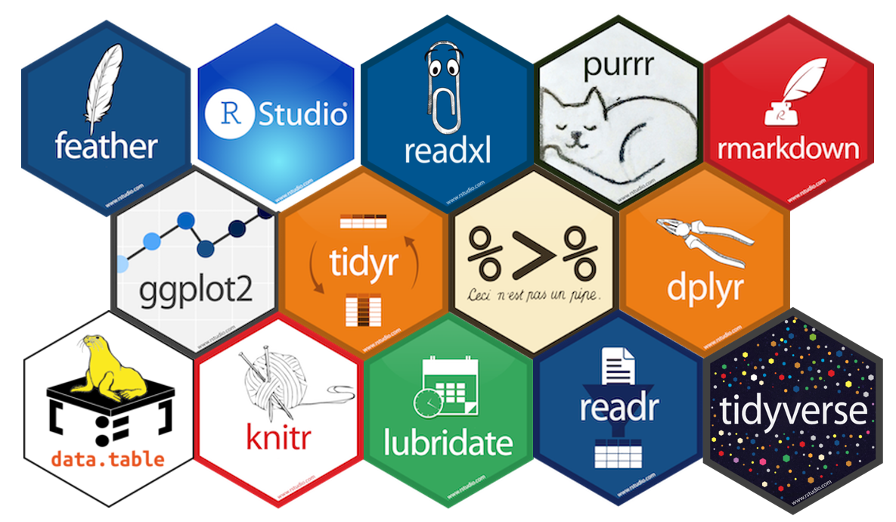

class: middle

# Agenda
- Presentación personal
- Motivación
- Proyectos & Áreas de Interés
- Recomendaciones Finales

---

.pull-left[
.center[
Carolina Montoya Rivera
------------------------------------ 


]
------------------------------------ 
Correo y redes: <a href=mailto:carolinamontoyarivera@gmail.com>carolinamontoyarivera@gmail.com </a>

[Github           ](https://github.com/Serilo/),  [LinkedIn](https://www.linkedin.com/in/carolina-montoya-rivera-382a57135/),
[Twitter](https://twitter.com/serilone)


------------------------------------
]
.pull-right[
### Educación
Bach. en Ciencias Actuariales (**UCR**)
### Experiencia
Instituto Nacional de Seguros.(**INS**)
(05/2017 - 08/2019)


### Intereses

- Seguros y Reaseguro.
- Manejo de Riesgos.
- Análisis de Datos.

### Programación

 - R, Risk Explorer, VBA, Mathematica, Matlab 

]

---

### Actividades

------------------------------------
- EMALCA 2014, SIMMAC 2014, CLAPEM 2016.

- ConectaR 2019 (Congreso Lationamerica de Usuarios de R).

   - *Comparación de Métodos de Clasificación Supervisada usando R*
   - *¿Cómo migrar de Excel a R? Un ejercicio práctico en la Industria* [Link](https://github.com/ConectaR2019/Presentaciones/blob/master/PRES05_VZuniga.pdf)
	
- Podcast para DataLatam: [Link](http://www.datalatam.com/45/)

- R-ladies: Miembro activo.
	Presentadora de la sesión: <br>
  - *Introducción a los Modelos Bayesianos con R*. Mayo, 2019.  [Link](https://serilo.github.io/Rladies/Pres.html)

- Conversatorio de Usuarios de R, 2019: [Link](https://twitter.com/Fichulina/status/1144280404259692544)

- Moody's Analytics Knowledge Services Bootcamp: Análisis de Inversiones, 2019. (80 horas)

- McKienze & Company. Young Women Leadership Program.

- LA-WHPC, 2019. [Link](https://serilo.github.io/LA-WHPC/Pres.html#1)
------------------------------------

---

background-image: url(STEM2.PNG)
background-position: 50% 50%

# Motivación: 

- Mujeres en campos CTIM(STEM): Ciencia, Tecnología, Ingeniería y Matemáticas.

.center[
"Numerosos estudios han encontrado que las mujeres en los campos STEM publican menos, se les paga menos por su investigación y no progresan tanto como los hombres en sus carreras."
]

.pull-right[
[Women in Science 2018, UNESCO](http://uis.unesco.org/en/topic/women-science)
]


- [We Have A Long Way To Go Before Women Are Equally Represented In The Sciences. Forbes, 2019](https://www.forbes.com/sites/jessicabaron/2019/02/11/we-have-a-long-way-to-go-before-women-are-equally-represented-in-the-sciences/#2b0a0e5c6168)

- [Mujeres STEM: Un desafío para Costa Rica. Semanario Universidad, 2019](https://semanariouniversidad.com/suplementos/mujeres-stem-un-desafio-para-costa-rica/)


.center[
"La inclusión de la mujer en los grupos científicos y su mayor incidencia es necesaria no solo por un tema de justicia, sino también porque la diversidad dentro de cualquier equipo de trabajo genera mejores resultados"
]
.pull-right[
[Semanario Universidad, 2018](https://www.ucr.ac.cr/noticias/2018/08/10/la-participacion-de-las-mujerescontinuarelegadaen-las-ciencias.html)
]


---
class: inverse, middle, center

# Proyectos & Áreas de Interés
---
class: middle

# ¿En qué he trabajado?

1. Elaboración de modelos actuariales de tarifaión para productos nuevos o existentes en el INS.

2. Remozamiento de estructuras tarifarias. Seguro Obligatorio Automotor (**SOA**).

3. Optimización actuarial de los contratos de reaseguro en el INS.

4. Valoración individual de riesgos a cotizar.

5. Optimización de procesos operativos.


---
# Manipulación y visualización de datos


---
# Optimización de Portafolios de Inversión

.pull-left[
- [PortfolioAnalytics](https://moderndata.plot.ly/portfolio-optimization-using-r-and-plotly/)
- [quantmod](https://cran.r-project.org/web/packages/quantmod/quantmod.pdf)  
]
.pull-right[
- [PerformanceAnalytics](https://cran.r-project.org/web/packages/PerformanceAnalytics/PerformanceAnalytics.pdf)
- [tidyquant](https://cran.r-project.org/web/packages/tidyquant/vignettes/TQ00-introduction-to-tidyquant.html)
]

```{r, echo=FALSE, message=FALSE, warning=FALSE, results='hide'}

# Manipular y visualizar datos
library(tidyverse)
library(tidyquant)
library(zoo)
library(plotly)

#Optimización de portafolio
library(PortfolioAnalytics)
library(quantmod)
library(PerformanceAnalytics)
library(quadprog)


# Obtenemos los datos directos de Yahoo Finance
symbols <- getSymbols(c("AMD", "AMGN", "BA", "CLX", "CVX","ESS","GS","SBUX","SRE","VMC"),from = " 2015-01-01",src = 'yahoo')
```

```{r, echo=FALSE, message=FALSE, warning=FALSE, results='hide'}
# Ejemplo Apple
getSymbols("SBUX",from = " 2015-01-01",src = 'yahoo')
```

```{r, echo=FALSE, message=FALSE, warning=FALSE,fig.height=5, fig.width=8, fig.align='center'}
#Visualización financiera
SBUX %>% 
chartSeries(name="SBUX",TA=c(addBBands()),
              subset='last 4 months',
              theme="white"
) 
```


---
class: middle, center

```{r, echo=FALSE, results='hide', message=FALSE, warning=FALSE}
prices.data <- merge.zoo(AMD[,6], AMGN[,6], BA[,6], CLX[,6], CVX[,6], ESS[,6], GS[,6], SBUX[,6], SRE[,6], VMC[,6])

returns.data <- na.omit(CalculateReturns(prices.data, method = c("log")))
colnames(returns.data) <- symbols

meanReturns <- colMeans(returns.data)
covMat <- cov(returns.data)

returns.data_cor <- returns.data %>%
  cor() 

p <- portfolio.spec(assets = colnames(returns.data))
p <- add.constraint(p, type = "box", min = 0.05, max = 0.8)
p <- add.constraint(portfolio = p, type = "full_investment")
p <- add.constraint(p, type="long_only")

# Generate random portfolios
randomport<- random_portfolios(p, permutations = 10000, rp_method = "sample")

# Get minimum variance portfolio
minvar.port <- add.objective(p, type = "risk", name = "var")

# Optimize
minvar.opt <- optimize.portfolio(returns.data, minvar.port, optimize_method = "random", 
                                 rp = randomport)

# Generate maximum return portfolio
maxret.port <- add.objective(p, type = "return", name = "mean")

# Optimize
maxret.opt <- optimize.portfolio(returns.data, maxret.port, optimize_method = "random", 
                                 rp = randomport)

minret <- min(meanReturns)
maxret <- max(meanReturns)
#maxret <- maxret.opt$weights %*% meanReturns

vec <- seq(minret, maxret, length.out = 100)

eff.frontier <- data.frame(Risk =vector("numeric", length(vec)) ,
                           Return = vector("numeric", length(vec)))

frontier.weights <- mat.or.vec(nr = length(vec), nc = ncol(returns.data))

colnames(frontier.weights) <- colnames(returns.data)

for(i in 1:length(vec)){
  p <- add.constraint(p, type = "return", name = "mean", return_target = vec[i])
  p <- add.objective(p, type = "risk", name = "var")
  eff.opt <- optimize.portfolio(returns.data, p, optimize_method = "ROI")
  eff.frontier$Risk[i] <- sqrt(t(eff.opt$weights) %*% covMat %*% eff.opt$weights)
  eff.frontier$Return[i] <- eff.opt$weights %*% meanReturns
  frontier.weights[i,] = eff.opt$weights
}

eff.frontier$Sharperatio <- eff.frontier$Return/eff.frontier$Risk

feasible.sd <- apply(randomport, 1, function(x){
  return(sqrt(matrix(x, nrow = 1) %*% covMat %*% matrix(x, ncol = 1)))
})

feasible.means <- apply(randomport, 1, function(x){
  return(x %*% meanReturns)
})

feasible.sr <- feasible.means / feasible.sd

p <- plot_ly() %>%
  add_trace(x = feasible.sd, y = feasible.means, color = feasible.sr, 
            mode = "markers", type = "scatter", showlegend = F,
            marker = list(size = 3, opacity = 0.5, 
                          colorbar = list(title = "Sharpe Ratio"))) %>%
  add_trace(data = eff.frontier, x = ~Risk, y = ~Return,mode = "markers", type = "scatter")%>% 
  layout(title = "Frontera Eficiente y Portafolios Simulados",
         yaxis = list(title = "Retorno promedio", tickformat = ".2%"),
         xaxis = list(title = "Desviación Estándar", tickformat = ".2%"))
```
```{r, echo=FALSE, message=FALSE, warning=FALSE, fig.align='center', fig.width=10}
p
```


---
# Análisis de Sobrevivencia

.pull-left[
- [survival](https://cran.r-project.org/web/packages/survival/survival.pdf)
- [survminer](https://cran.r-project.org/web/packages/survminer/survminer.pdf)
]
.pull-right[
- [KMsurv](https://cran.r-project.org/web/packages/KMsurv/KMsurv.pdf)
]
```{r, message=FALSE, warning=FALSE, fig.align='center', echo=FALSE, fig.width=8, fig.height=6}
library(survival)
library(survminer)
library(grid)
library(gridExtra)
library(KMsurv)

## Cargamos los datos
data(lung, package="survival")

## Convertimos el status a factor. 1-Vivo, 2-Muerto.
lung$status <- factor(lung$status)
levels(lung$status) <- c("V","M")

## Convertimos el sex a factor. 1-Masculino, 2-Femenino.
lung$sex <- factor(lung$sex)
levels(lung$sex) <- c("M","F")

## Convertimos el status a factor. 1-Vivo, 2-Muerto.
lung$status <- factor(lung$status)
levels(lung$status) <- c("V","M")

## Convertimos el sex a factor. 1-Masculino, 2-Femenino.
lung$sex <- factor(lung$sex)
levels(lung$sex) <- c("M","F")


#Gráfico Seguimiento del status del paciente durante el estudio
p1 <- lung %>% mutate(age_orig = age,
                age_end = age + time/360,
                id =seq(1:dim(lung)[1])) %>%
  ggplot(aes(x = id, y = time)) +
  geom_linerange(aes(ymin = 0, ymax = time)) +
  geom_point(aes(shape = status, color =status), stroke = 1, cex = 2) +
  scale_shape_manual(values = c(1, 4)) + guides(fill = FALSE) +
  labs(y = "Días del estudio", x = "ID paciente",  title = "Seguimiento del status del paciente con cáncer pulmonar avanzado durante el estudio") + coord_flip()+theme_bw()
p1
```
---
class: middle, center
```{r, message=FALSE, warning=FALSE, fig.align='center', echo=FALSE, fig.width=11}
## Agregamos un objeto de sobrevivencia. Status 2 es el status de muerte.
lung$SurvObj <- with(lung, Surv(time, status == "M"))

## Primer estimador no paramétrico de la sobrevivencia: Kaplan-Meier
KM <- survfit(SurvObj ~ 1, data = lung)
p1 <- ggsurvplot(KM, risk.table = TRUE, xlab = "Time (years)", censor = T,ggtheme = theme_bw())

KM_s <- survfit(SurvObj ~ sex, data = lung)
p2 <-ggsurvplot(KM_s, risk.table = TRUE, xlab = "Time (years)", censor = T,ggtheme = theme_bw())


arrange_ggsurvplots(list(p1, p2), ncol = 2)  
```


---

# Clasificación Automática y Reducción de Dimensionalidad

.pull-left[
- [caret](https://rpubs.com/joser/caret)
]
.pull-right[
- [FactoMineR](http://www.sthda.com/english/articles/31-principal-component-methods-in-r-practical-guide/117-hcpc-hierarchical-clustering-on-principal-components-essentials/)  
- [factoextra](http://www.sthda.com/english/articles/31-principal-component-methods-in-r-practical-guide/117-hcpc-hierarchical-clustering-on-principal-components-essentials/)
]
```{r, echo=FALSE, warning=FALSE, message=FALSE, fig.width=10, fig.height=5}
library(FactoMineR)
library(factoextra)

# Cargamos datos
data(tea)

# MCA
res.mca <- MCA(tea, 
               ncp = 20,            # Número de componentes que se toman
               quanti.sup = 19,     # Variables cuantitativas suplementarias
               quali.sup = c(20:36), # Variables cualitativas suplementarias
               graph=FALSE)
res.hcpc <- HCPC (res.mca, graph = FALSE, max = 3)

# Dendograma
p1 <- fviz_dend(res.hcpc, show_labels = FALSE)

# Mapa de individuos
p2 <- fviz_cluster(res.hcpc, geom = "point", main = "Factor map")+theme_bw()
grid.arrange(p1,p2, ncol=2)
```


---


.pull-left[
## Teoría de Valor Extremo.


- [actuar](https://cran.r-project.org/web/packages/actuar/actuar.pdf)
- [evir](https://cran.r-project.org/web/packages/evir/evir.pdf)
- [fExtremes](https://cran.r-project.org/web/packages/fExtremes/fExtremes.pdf)
- [ReIns](https://cran.r-project.org/web/packages/ReIns/ReIns.pdf)

## Reportería y Presentaciones
- [rmarkdown](https://rmarkdown.rstudio.com/)
- [xaringan](https://bookdown.org/yihui/rmarkdown/xaringan.html)

## Visualización dinámica
- [plotly](https://plot.ly/r/)
- [flexdashboard](https://rmarkdown.rstudio.com/flexdashboard/)
- [shiny](https://shiny.rstudio.com/)

]

.pull-right[


### Ejemplos
- [dygraph](https://rstudio.github.io/dygraphs/) y [leaflet](https://rstudio.github.io/leaflet/)
<br>

```{r, fig.height=3.5,fig.width=5, echo=FALSE, message=FALSE, warning=FALSE, fig.align='left'}
library(dygraphs)
library(forecast)

lungDeaths <- cbind(mdeaths, fdeaths)
dygraph(subset(lungDeaths, start=25))
```

<br>
```{r, fig.height=2,fig.width=5, echo=FALSE, message=FALSE, warning=FALSE, fig.align='right'}
library(leaflet)
leaflet() %>% addTiles() %>% setView(-84.124984, 9.951143, zoom = 15)
```
] 
---
class: inverse, middle, center

# Recomendaciones finales 
---

background-image: url(STEM3.PNG)
background-position: 50% 50%


# Incursionar en CTIM. ¿Cómo?


- Informémonos.
- Cuestionemos.
- Descubramos.
    - Network.
    - Sororidad.
    - ¿Cúales son mis puntos fuertes?

- ¿Cómo puedo mejorar?

- Involucrarse en organizaciones con intereses afines. 
    - [R-ladies](https://rladies.org/about-us/)
    - [R-Forwards](https://forwards.github.io/about/)
    - [500 Women Scientists](https://500womenscientists.org/who-we-are)
    - Iniciativas de inclusión y empoderamiento por parte de empresas o academia.


---
class: inverse, middle, center

# Muchas gracias

Esta presentación está hecha con [**xaringan**](https://github.com/yihui/xaringan).

